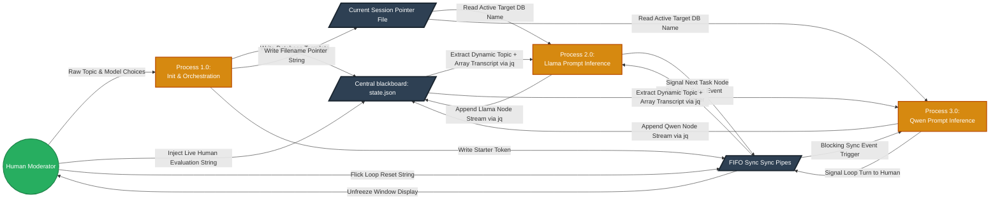
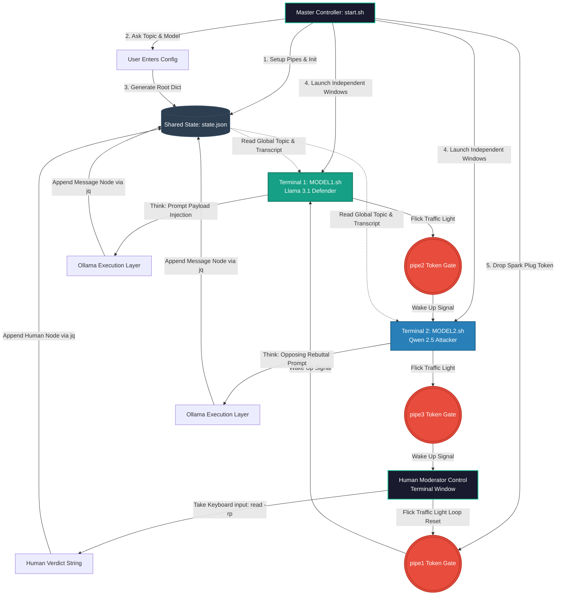

# Overview  
This project uses bash and gnome-terminal please check your terminal before running it and make necessary changes accordingly
## Workflow  
This diagram below demonstrates the general workflow of project(work in progress).

# DFD(Level 1)  
This diagram below lines out general data flow happening(work in progress).
